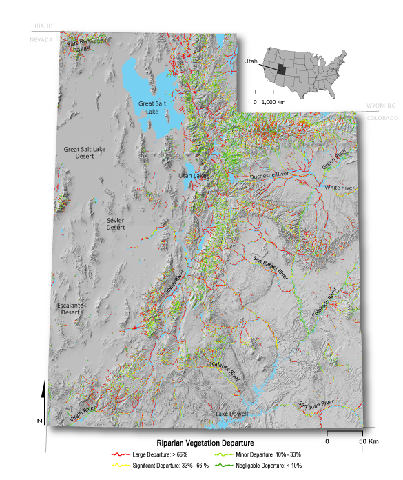

### R-CAT: Riparian Condition Assessment Tool

<link rel="shortcut icon" type="image/x-icon" href="favicon.ico">

Welcome to the R-CAT website. The Riparian Condition Assessment Tool ([R-CAT](https://bitbucket.org/jtgilbert/riparian-condition-assessment-tools/)) is a suite of stream network assessment tools. These tools are designed to delineate valley bottoms, assess riparian vegetation, evaluate floodplain condition and estimate recovery potential of riparian areas. The stream network models consist of the following: the Valley Bottom Extraction Tool ([V-BET]({{ site.baser.url }}/Documentation/VBET), Riparian Vegetation Departure ([RVD](https://bitbucket.org/jtgilbert/riparian-condition-assessment-tools/wiki/Tool_Documentation/Version_1.0/RVD)) tool, Riparian Condition Assessment ([RCA](https://bitbucket.org/jtgilbert/riparian-condition-assessment-tools/wiki/Tool_Documentation/Version_1.0/RCA)) tool and Riparian Recovery Potential (RRP) tool. These tools are intended to help researchers and managers assess riparian condition and recovery potential over large regions and watersheds.

These network models were first developed and implemented across the Colorado Plateau Ecoregion and the state of Utah (see [Utah Implementation](http://etal.joewheaton.org/rcat/r-cat-applications/utah) page). The models are now being run for the Interior Columbia River Basin (see [Columbia River Basin Implementation](http://etal.joewheaton.org/rcat/r-cat-applications/columbia-river-basin-implementation) page) . 

The [R-CAT](https://bitbucket.org/jtgilbert/riparian-condition-assessment-tools/) models can be run with nationally available existing GIS datasets or high resolution landcover and DEM datasets.  

 

### Development Team

The ETAL development team consisted of [Wally Macfarlane](http://etal.joewheaton.org/people/researchers-technicians/Wally), [Jordan Gilbert](http://etal.joewheaton.org/people/researchers-technicians/jordan-gilbert), [Joe Wheaton](http://etal.joewheaton.org/people/dr-joe-wheaton), [Josh Gilbert](http://etal.joewheaton.org/people/researchers-technicians/joshua_gilbert), [Chalese Hafen](http://etal.joewheaton.org/people/researchers-technicians/chalese-hafen), [Martha Jensen](http://etal.joewheaton.org/people/students/martha-jensen), [Elijah Portugal](http://etal.joewheaton.org/system/errors/NodeNotFound?suri=wuid:gx:63ea5df2319bfdec), and [Peter McHugh](http://etal.joewheaton.org/people/researchers-technicians/pete-mchugh).

### Publications

- Gilbert, J.T, W.W Macfarlane, M.L. and J.M. Wheaton 2016.  V-BET: A GIS tool for delineating valley bottoms across entire drainage networks. Computers and Geosciences 97:1-14.  [http://www.sciencedirect.com/science/article/pii/S0098300416301935](http://www.sciencedirect.com/science/article/pii/S0098300416301935)
- Macfarlane, W.W., J.T. Gilbert, M.L. Jensen, J. D. Gilbert, N. Hough-Snee, P.A. McHugh, J.M. Wheaton, and S.N. Bennett 2016. Riparian vegetation as an indicator of riparian condition: detecting departures from historic condition across the North American West. Journal of Environmental Management. [http://www.sciencedirect.com/science/article/pii/S0301479716308489](http://www.sciencedirect.com/science/article/pii/S0301479716308489)
- In prep. Macfarlane, W.W., J.T. Gilbert, M.L., N. Hough-Snee, C. Saunders , C.W. Hafen, and J.M. Wheaton. What is the condition of floodplain riparian areas of the western U.S.? Identifying impaired floodplain ecosystems using the Riparian Condition Assessment tool (RCA). For submission to Environmental Management. 

### Limitations of Outputs Driven with Nationally Available Data

- The initial R-CAT analyses produce remarkably coherent results despite the [resolution of nationally available inputs]({{ site.baseurl }}/Landfire). Currently, the Utah and the Columbia River Basin outputs have been produced with [LANDFIRE ](http://landfire.gov/)and the following limitations should be understood:
  - LANDFIRE 30 meter vegetation data is sometimes too coarse to provide sufficient detail to adequately map riparian vegetation. LANDFIRE 30 meter vegetation data tends to underestimate the spatial extent of invasive riparian vegetation. - *While higher resolution imagery is used in some localities to drive landcover and vegetation classifications, nothing yet exists that is freely and nationally available.*
  - Riparian condition is overestimated in incised and entrenched streams because incision and entrenchment are currently not considered in the Riparian Condition Assessment. - *Incision is straightforward to identify through manual reconnaissance, and with the aide of higher resolution topography (not typically possible with 10 m NED).*
  - Riparian recovery potential tends to be overestimated because the model currently does not account for water diversions and dams that limit the recovery of riparian areas. - *Most states do not have these data in a consistent format, much less at a national level.*

### Interested In Helping?

 If you are interested in helping us improve R-CAT please contact us. We view these [R-CAT products ](http://etal.joewheaton.org/rcat/r-cat-applications/utah)as a first iteration and as better input data is available the output products will improve proportionally.

### R-CAT products Financial Support

The development of R-CAT was primarily initially funded by:

1.  The [Bureau of Land Management](http://blm.gov/) (BLM), 
2.  The [Utah Department of Natural Resources](http://naturalresources.utah.gov/), through the Utah Endangered Species Mitigation Fund (ESMF), and
3.  The [Utah Division of Wildlife Resources](http://wildlife.utah.gov/) (UDWR) through Pittman-Robertson Wildlife Restoration Act (PR) funds.

Subsequent funding and support for application of these products in the Columbia River Basin, has come from [Bonneville Power Administration](http://bpa.gov/) through [Eco Logical Research](http://ecologicalresearch.net/).

### Model

### Documentation - How to Run
- [NHD Network Builder]({{ site.baseurl }}/Documentation/Version_1.0/NHD)
- [Valley Bottom Extraction Tool (VBET)]({{ site.baseurl }}/Documentation/Version_1.0/VBET)
- [Riparian Vegetation Departure (RVD)]({{ site.baseurl }}/Documentation/Version_1.0/RVD)
- [Riparian Condition Assessment (RCA)]({{ site.baseurl }}/Documentation/Version_1.0/RCA)

### Source Code

RCAT is fully documented for those looking to apply the scripts or coders looking to extend the scripts. The current Python source code is open source and we have developed ArcGIS tool boxes. Source code is available at [https://github.com/Riverscapes/RCAT](https://github.com/Riverscapes/RCAT).

### Some R-CAT Outputs
[R-CAT Applications]({{ site.baseurl }}/R-CATApplications)

- [Columbia River Basin (CRB) Implementation]({{ site.baseurl }}/CRBImplementation)
  - [CRB R-CAT Map Atlas]({{ site.baseurl }}/CRBR-CATMapAtlas)
- [Utah Implementation]({{ site.baseurl }}/UtahImplementation)
  - [LANDFIRE Data Limitations]({{ site.baseurl }}/Landfire)
  - [Utah R-CAT Map Atlas]({{ site.baseurl }}/UtahR-CATMapAtlas)
  - [Weber River Styles Comparison]({{ site.baseurl }}/WeberRiverStylesComparison)

- [Interpreting RCAT Outputs]({{ site.baseurl }}/InterpretingRCATOutputs)